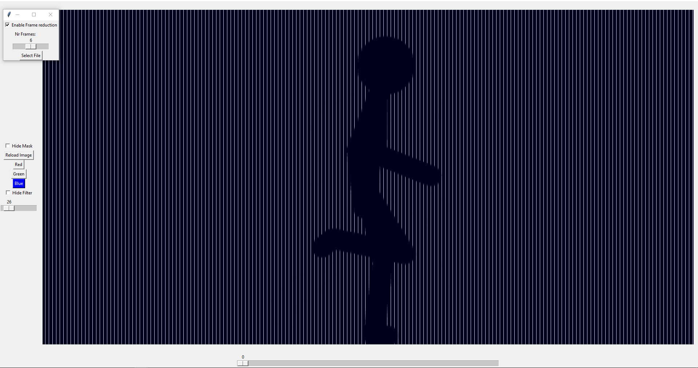
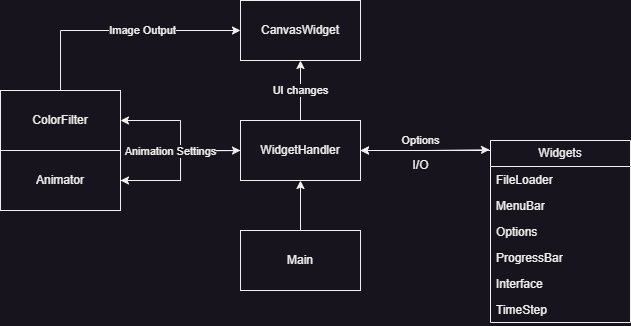

# Barrier-grid-Animator
The goal of this project is to create a tool that can be used to generate barrier-grid animations. It is an optical illusion that is interpreted by the human visual system as animation.\
\
 The complete source code can be found at: [https://github.com/Egglis/Barrier-grid-Animator](https://github.com/Egglis/Barrier-grid-Animator)




## Running the program
The project was implmented with python3. The GUI was implmented using tkinter [[1]](#1) while the image manipulation was done using the Pillow library [[2]](#2). The project can be ran using any IDE by running <code>main.py</code>. The repository contains a <code>ExampleGifs</code> folder which contains example gifs that can be used to test the program.The program currently only supports gifs, but can be easily extended to support other image/video formats.

In the top-left corner of the application window, users can select a file, which opens a secondary prompt where they can choose the gif they want to use. The window also provides options for "frame reduction," which is enabled by default and determines the number of frames the final image is based on. This feature is useful for reducing the frame count in large gifs, where certain sections of the gif are very similar.

The rest of the GUI includes a bottom slider, which serves as a timeline and allows users to slide the black bars across, similar to how a real-world barrier grid is moved.


The left-hand options consist of a "hide mask" and "hide filter" feature. The mask refers to the black bars, while the filter applies a colored filter effect. On the left side of the UI, there is a reload button that refreshes the image, useful in situations where the image does not update correctly when viewport changes occur. Three buttons are available for selecting different colored filters. Finally, the left slider adjusts the intensity of the filter, enabling users to make the filter more or less visible.

## The Code
The code structure consists of three main components:
1. The preview/canvas where the image is displayed: <code> CanvasWidget.py </code>
2. The algorithm that generates the final image and color filter: <code> Animator.py, ColorFilter.py</code>
3. The widgets that make up the UI: <code> WidgetHandler.py </code> and <code> /Widgets</code> folder.

All components communicate via the <code>WidgetHandler</code> which handles all input/output for the GUI and applies them to the image generators which is finally displayed in the canvas. The <code> Functions.py </code> includes several supporting functions and classes which are used across the project.

The structure can be summerized as follows:



The code has lots of room for improvment, but the current structure is sufficient for the current scope of the project. The code is well documented and should be easy to follow. Meanwhile the algorithm for generating the final barrer gird animation is explained in the following section.

### <code> Animator.py </code>

The algorithm starts by creating a new base image using <code>Image.new()</code>. It initializes an RGBA image with dimensions specified in the setup phase. 

```python
includedFrames = self.reduceNumberOfFrames()
```

Before generating the final image, the alogrithm utelize a pre-processing step of reducing the total frames based on the specification when selecting a gif. <code> includedFrames </code> thus includes all the frames which are going to be included in the computation of the final image. 

```python
while col < self.currentSize.x:
    for frame in ImageSequence.Iterator(self.currentSequence):
```
A while loop iterates the columns of the newly generated image. It continues until the column reaches the maximum width.Inside the loop, a for loop is used to iterate through the frames of the current image sequence. The <code> frame </code> variable represents each individual frame.

```python
if frameIndex in includedFrames:
        frame = frame.resize((self.currentSize.x, self.currentSize.y))
        frame = frame.convert("RGBA")
```	
Afterwards the frame number is checked with the frame reduction while also resizing the frame to the current size of the image. The frame is then converted to RGBA format. 

```python
 for j in range(self.hatch_width):
            if col < self.currentSize.x:
                for row in range(self.currentSize.y-1):
                    new_image.putpixel((col, row), frame.getpixel((col, row)))
```
Inside nested loops, the code iterates through each column, row, and hatch width. Where hatch width refers to the width of a single black bar.It checks if the column is within the bounds of the new image. If so, it retrieves the pixel color value from the corresponding position in the frame using. It then assigns this pixel color to the corresponding position.

```python
col += 1
steps += 1
progress_bar.step()
```
After processing the current column, the code increments the <code> col </code> variable, increments a <code> steps </code> counter, and updates a progress bar (represented by <code> progress_bar </code>) to indicate the progress of the algorithm. Finally it incrments the <code> frameIndex </code> to keep track of the current frame index in the image sequence.

Once all the frames and columns have been processed, the function returns a <code> ImageTk.PhotoImage </code> which can be displayed in a Tkinter canvas.

## Summery of findings
- The algorithm operates at a sluggish pace, resulting in considerable delays when generating the final image.
- Frame reduction is crucial for nearly all gifs, as any gif exceeding 10 frames becomes nearly imperceptible as an "animation."
- Frame reduction is also essential for optimizing performance.
- Gifs with only 6 frames produce the most visually appealing results. However, at this stage, it may be worth exploring alternative methods for creating paper-like animations.


## Further Information and suggestions
For additional information on this topic, I highly recommend referring to the Wikipedia page on  [Barrier-grid animation and stereography](https://en.wikipedia.org/wikiBarrier-grid_animation_and_stereography) [[3]](#3). It provides a detailed explanation of the concept. If you're looking for a more comprehensive implementation of barrier grid animation, I suggest exploring [Animabar v1.2](http://animbar.mnim.org) [[4]](#4). It offers a complete implementation of the technique; however, please note that it does not include features for importing gifs or applying color filters.

Here are a few suggestions and ideas that I developed during the course of this project but didn't have enough time to implement:
- Cross-fading gifs: Explore the possibility of incorporating smooth transitions between different gifs to create visually appealing effects.
- Circle barrier animation: Experiment with circular barriers to introduce unique animation patterns and movements.
- More complex barrier: Consider implementing intricate barrier designs to enhance the overall visual impact.

These ideas hold potential for expanding the project's capabilities and creating even more captivating animations.

Further reading:
- [https://marco.guardigli.it/2010/01/scanimation-builder-processing-code.html](https://marco.guardigli.it/2010/01/scanimation-builder-processing-code.html)
- [https://www.instantfundas.com/2009/12/scanimation-creating-software-impress.html](https://www.instantfundas.com/2009/12/scanimation-creating-software-impress.html)
- [https://www.opticalillusion.net/optical-illusions/animated-moire-or-scanimation/](https://www.opticalillusion.net/optical-illusions/animated-moire-or-scanimation/)

### References

<a id="1">[1]</a> [https://docs.python.org/3/library/tkinter.html](https://docs.python.org/3/library/tkinter.html)

<a id="2">[2]</a> [https://pypi.org/project/Pillow/](https://pypi.org/project/Pillow/)

<a id="3">[3]</a> [https://en.wikipedia.org/wiki/Barrier-grid_animation_and_stereography](https://en.wikipedia.org/wiki/Barrier-grid_animation_and_stereography)

<a id="4">[4]</a> [http://animbar.mnim.org](http://animbar.mnim.org)
